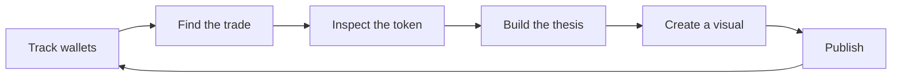
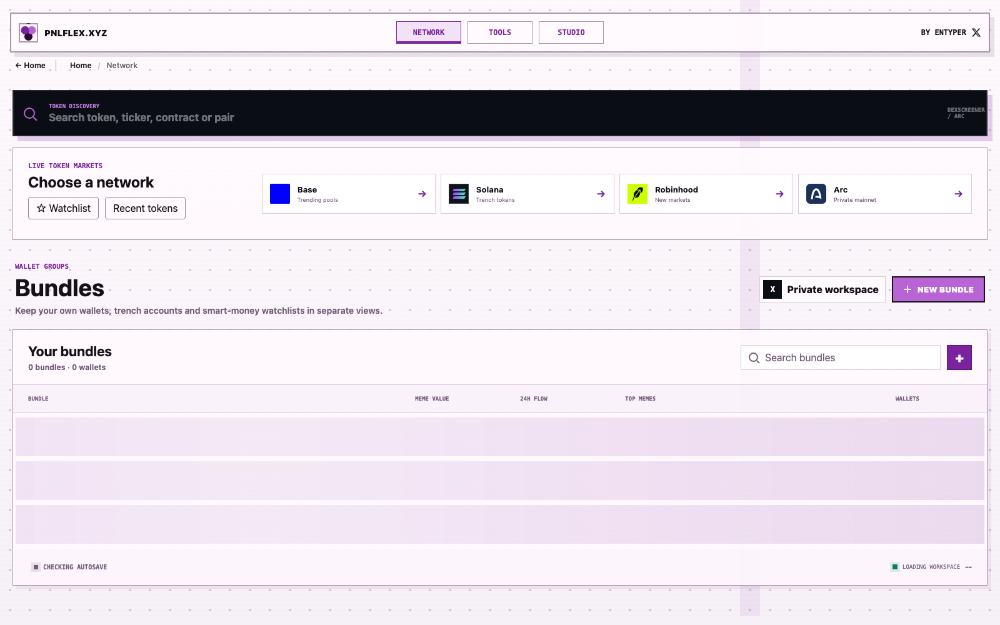
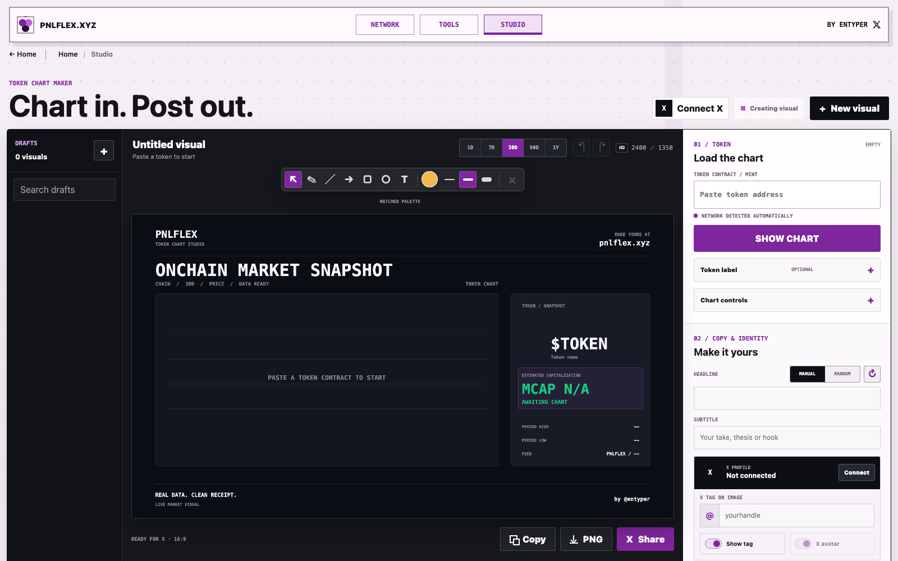
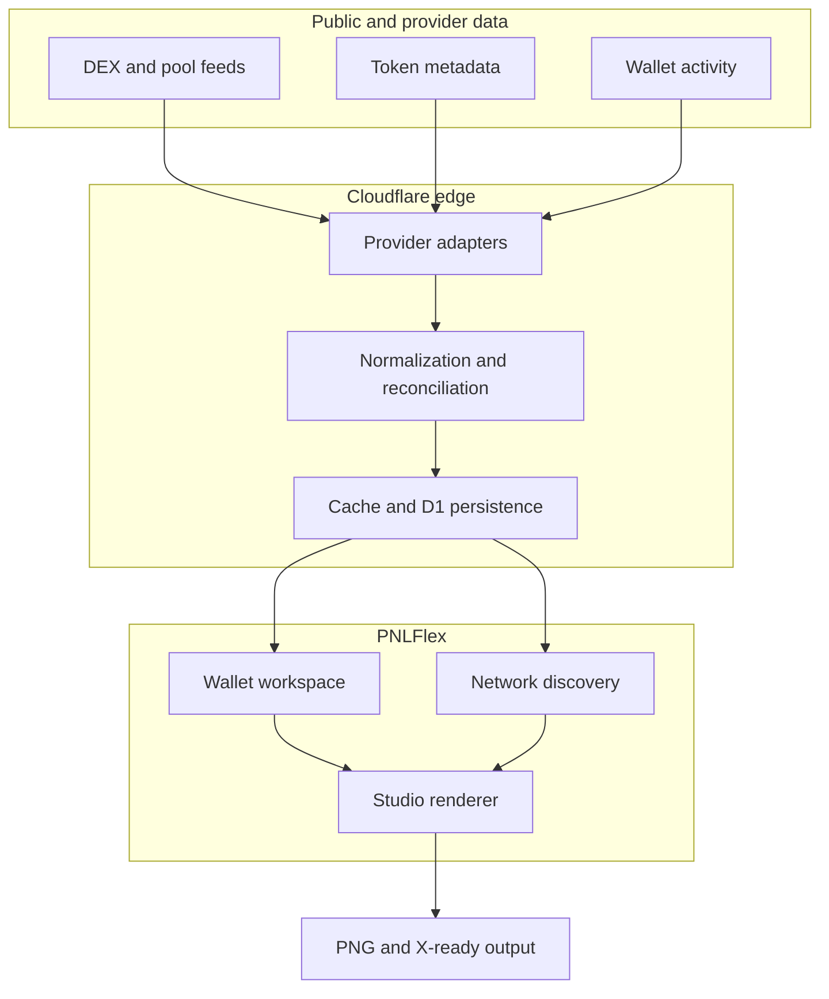

<div align="center">

# PNLFlex

### Track wallets and PnL. Discover the next chart. Turn the thesis into a visual.

[](https://pnlflex.xyz)
[](https://pnlflex.xyz/studio)
[](#repository-scope)

One connected workspace for onchain research and crypto content creation.

</div>


| Product | My contribution | Status | Core stack |
| --- | --- | --- | --- |
| Wallet intelligence and creator studio | Product design, UX, market-data architecture, PnL methodology, chart tooling, and delivery | Live product | TypeScript, React, Cloudflare, multi-provider onchain APIs |

## The product

PNLFlex joins two jobs that normally happen in separate tools:

1. **Wallet intelligence**: organize wallets, inspect positions and activity, and understand where realized profit or loss came from.
2. **Creator Studio**: turn a token, chart, and market thesis into a distinctive visual ready for X.

Instead of moving through a wallet tracker, token screener, charting app, image editor, and social app, the user can follow one continuous loop:



## Why it exists

Onchain data is abundant, but the workflow around it is fragmented. A headline PnL number rarely explains its own methodology. A chart rarely carries the context behind the move. A generic export rarely feels like it belongs to the creator who posted it.

PNLFlex is designed to answer four connected questions:

| Question | Product surface |
| --- | --- |
| What did this wallet actually trade? | Wallet workspace and activity inspection |
| Where did the profit or loss come from? | Realized PnL, coverage states, and trade-level detail |
| What is happening with the token now? | Network discovery and normalized market data |
| How do I explain it clearly? | Studio themes, annotations, drawing, and export |

## Product tour

### 1. Discover across networks



Network is the discovery layer. It combines token search, chain navigation, watchlists, recent tokens, and wallet bundles in one consistent interface.

- Search by token name, symbol, contract, or pair.
- Browse Solana, Base, BNB Chain, Robinhood Chain, and Arc markets.
- Compare market cap, FDV, liquidity, volume, age, and price movement.
- Preserve real token imagery through layered metadata fallbacks.
- Open any supported token directly in Studio.

### 2. Create a visual in Studio



Studio is a chart composition tool built for crypto creators. The chart is the working surface rather than a static preview.

- Load a token contract with automatic network detection.
- Switch between 1D, 7D, 30D, 90D, and 1Y views.
- Use line, area, or native OHLC chart formats when source data supports them.
- Draw with pen, line, arrow, box, oval, and text tools.
- Pin chart points, inspect values, and add buy, sell, or thesis markers.
- Apply creator themes, custom palettes, typography, composition, and PNG layers.
- Save, rename, and reuse personal themes.
- Export a high-resolution PNG or an X-ready visual.

### 3. Return to the wallet context

The creator workflow does not end at export. Tokens, wallets, watchlists, and saved views keep the research context available for the next update, follow-up, or post.

## Core capabilities

| Area | Capability | Product intent |
| --- | --- | --- |
| Wallets | Mixed EVM and Solana bundles, labels, roles, saved views | Monitor a thesis across addresses, not isolated lookups |
| PnL | Realized results, coverage states, daily drill-down | Make the number auditable and expose incomplete history |
| Discovery | Multi-chain search, sorting, filters, watchlists | Move quickly from signal to token context |
| Market data | Price, market cap, FDV, liquidity, volume, age | Keep metrics explicit instead of silently substituting them |
| Charts | Timeframes, candles, line, area, volume | Match the visual to the available history and intended story |
| Annotation | Drawings, labels, markers, fixed points | Put the creator's thesis directly on the chart |
| Identity | Themes, colors, type, layout, avatar, handle | Make repeated posts recognizable without rebuilding them |
| Export | High-resolution PNG, copy, X share | Reduce the distance between research and publishing |

## Engineering highlights

### Market data normalization

Different providers expose different symbols, pairs, supply figures, timestamps, and history depths. PNLFlex normalizes these into one product model while preserving source and freshness information.

### Timeframe-stable valuation

Historical chart sampling and the current token valuation are resolved separately. Changing the timeframe must not invent a different current market cap. Market cap, FDV, and estimated capitalization remain distinct states.

### Cross-chain metadata resolution

Token identity uses layered fallbacks for name, symbol, image, decimals, and network. The UI degrades to a clear placeholder when metadata cannot be verified rather than displaying an unrelated asset.

### Canvas-native composition

Studio renders charts, annotations, creator identity, and decorative layers into the same high-resolution composition used for export. The exported image therefore matches the working canvas.

### Honest PnL states

PnL is only as reliable as indexed history and cost basis. The product distinguishes verified values, partial coverage, unavailable cost basis, and unsupported data instead of presenting every estimate as exact.

## Implementation details

### Request topology

PNLFlex runs as a Cloudflare Worker with Node.js compatibility. The Worker separates static delivery from dynamic execution before a request reaches the application server:

```text
Request
  -> dynamic route (/api, /card, /og, /health)
       -> Node-compatible HTTP handler
  -> product alias (/, /network, /studio, /tools)
       -> Cloudflare static asset binding
  -> static miss
       -> application handler fallback
```

This keeps ordinary HTML, CSS, JavaScript, and image delivery at the edge while API, card, and Open Graph requests share the same server-side application contracts. Local-only tooling is explicitly rejected by the production Worker.

### Market-data pipeline

A Studio chart request passes through a deterministic normalization pipeline:

1. Detect or validate the network from the contract format and provider response.
2. Resolve exact token identity instead of accepting a same-symbol match.
3. Fetch token metadata and available pools.
4. Rank pools by USD reserves and select the most liquid candidate.
5. Choose the candle interval and aggregation from the requested time window.
6. Normalize provider rows into one ascending OHLCV shape.
7. Resolve market-cap semantics and supply independently from chart sampling.
8. Append a current live point when the latest historical candle is stale.
9. Return source, interval, data shape, value type, generated time, and token metadata with the candles.

Every chart therefore uses the same internal contract:

```js
{
  source,
  valueType,   // price | market_cap | total_market_cap | fdv | estimated_market_cap
  dataShape,   // ohlcv | price_points
  interval,
  candles: [{ time, open, high, low, close, volume }],
  token,
  generatedAt
}
```

### Valuation rules

Current valuation is resolved separately from historical candles so switching from 1D to 1Y cannot change the latest displayed capitalization merely because a provider sampled a different history window.

| Available data | Supply used | Displayed state |
| --- | --- | --- |
| Total supply and FDV | Total supply | Total market cap |
| Total supply and price | Total supply | Total market cap derived from price |
| Circulating supply and market cap | Circulating supply | Market cap |
| Price and a verified supply fallback | Matching supply | Estimated market cap |
| Price only | None | Price; capitalization remains unavailable |

Native market-cap candles are never multiplied by supply a second time. Saved drafts may contain stale supply, so a fresh provider valuation takes priority when a chart is reloaded.

### Studio state model

Studio projects are schema-normalized on every write instead of storing arbitrary editor state. A project is separated into six domains:

```text
project
  source       token, network, metadata, wallet events
  chart        timeframe, metric, series style, density, scale
  content      headline, thesis, creator identity, privacy flags
  style        template, palette, typography, layout, texture, PNG layer
  annotations  buy, sell, and note markers tied to chart time
  drawings     normalized vector layers tied to the visual
```

Drawing coordinates are stored from `0` to `1`, rather than in screen pixels. This allows the same annotation layer to survive responsive preview sizes and the final 2400 x 1350 export. Pointer capture keeps a stroke active outside the initial element bounds, while chart hover is suspended whenever drawing or annotation editing is active.

The server enforces explicit limits: 50 saved projects per workspace, 24 chart annotations, 64 drawing layers, 120 points per drawing, and PNG overlays up to 4 MB and 4096 x 4096 pixels. Uploaded PNGs are signature-checked, dimension-checked, content-addressed with SHA-256, and served with immutable caching.

### Persistence model

Production state uses a small versioned document layer over Cloudflare D1:

- logical records are separated by namespace and a SHA-256 hash of the external key;
- JSON payloads are divided into chunks of up to 90,000 characters;
- chunks are written in batches, then a metadata row points to the complete version;
- reads require the expected chunk count and reconstruct JSON in index order;
- a new random version prevents a partially written payload from becoming current;
- the same repository interface falls back to atomic temporary-file renames during local development.

Anonymous Studio workspaces use the browser session ID. When an X identity becomes available, an existing anonymous workspace is migrated once into the account-scoped workspace instead of losing drafts.

### Rendering and export

The Studio preview and export use the same Canvas renderer. Themes, market data, chart geometry, token metadata, creator identity, drawings, and uploaded overlays are composed into a fixed 16:9 render target. Export uses `canvas.toBlob()` to produce a PNG directly from that composition, avoiding a second layout implementation that could drift from the editor.

## Architecture



## Data integrity principles

- **Label the metric**: market cap, FDV, and estimated capitalization are not interchangeable.
- **Show provenance**: source, fetch time, and available history depth belong in the interface.
- **Keep current values stable**: timeframe changes affect the window, not the latest valuation.
- **Prefer unavailable over invented**: unknown metadata or cost basis stays visibly unknown.
- **Protect credentials**: external data adapters and secrets remain on the server side.
- **Exclude misleading assets**: wrapped native assets and DeFi receipt tokens are not treated as ordinary trade PnL when that would distort the result.

## Verification strategy

The project uses Node's built-in test runner for focused domain and integration coverage. The current suite contains 28 tests covering:

- weighted-average realized PnL and UTC calendar allocation;
- exclusion of ETH, wrapped assets, and receipt tokens;
- missing cost basis, transfers, duplicates, and incomplete histories;
- fixed-supply and circulating-supply valuation behavior;
- shared current quotes across timeframe caches;
- exact-chain token image resolution and safe image proxying;
- Studio persistence, drawing/hover isolation, PNG layers, and identity settings;
- mixed-chain wallet bundles, pagination, alerts, and persistent restoration;
- free-data mode and production isolation of local-only tools.

Latest local verification: **28 passed, 0 failed**.

## Stack

| Layer | Technology |
| --- | --- |
| Runtime | Cloudflare Workers |
| Persistence | Cloudflare D1 |
| Frontend | JavaScript, HTML, CSS |
| Visualization | HTML Canvas, Lightweight Charts |
| Server adapter | Node.js HTTP handler on Cloudflare Workers |
| Market discovery | GeckoTerminal, DEX Screener, provider adapters |
| Delivery | Cloudflare edge and custom domain |

## Current product status

| Surface | Status | Link |
| --- | --- | --- |
| Main product | Live | [pnlflex.xyz](https://pnlflex.xyz) |
| Network | Live | [pnlflex.xyz/network](https://pnlflex.xyz/network) |
| Studio | Live | [pnlflex.xyz/studio](https://pnlflex.xyz/studio) |
| Wallet PnL | Provider-dependent | Availability depends on indexed history and configured data coverage |

## Repository scope

This is a **public product showcase**, not the production source repository. It documents the problem, user experience, system design, and selected engineering decisions behind PNLFlex.

Production code, private integrations, operational configuration, credentials, and user data are intentionally excluded.

## Author

Built by [@entyper](https://x.com/entyper).

---

<div align="center">
  <strong>Real data. Clear visuals. Built for the feed.</strong>
</div>
