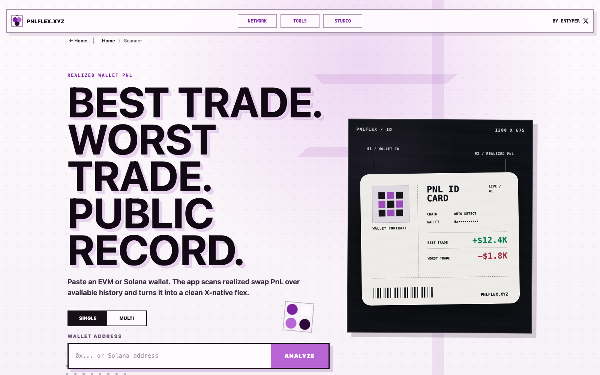

# PNLFlex

### Track wallets and PnL. Discover the next chart. Turn the thesis into a visual.

One connected workspace for onchain research and crypto content creation.

## The product

PNLFlex joins two jobs that normally happen in separate tools:

1. **Wallet intelligence**: organize wallets, inspect positions and activity, and understand where realized profit or loss came from.
2. **Creator Studio**: turn a token, chart, and market thesis into a distinctive visual ready for X.

Instead of moving through a wallet tracker, token screener, charting app, image editor, and social app, the user can follow one continuous loop:

~~~mermaid
flowchart LR
    A[Track wallets] --> B[Find the trade]
    B --> C[Inspect the token]
    C --> D[Build the thesis]
    D --> E[Create a visual]
    E --> F[Publish]
    F --> A
~~~

## Why it exists

Onchain data is abundant, but the workflow around it is fragmented. A headline PnL number rarely explains its own methodology. A chart rarely carries the context behind the move. A generic export rarely feels like it belongs to the creator who posted it.

PNLFlex is designed to answer four connected questions:

| Question | Product surface |
| --- | --- |
| What did this wallet actually trade? | Wallet workspace and activity inspection |
| Where did the profit or loss come from? | Realized PnL, coverage states, and trade-level detail |
| What is happening with the token now? | Network discovery and normalized market data |
| How do I explain it clearly? | Studio themes, annotations, drawing, and export |

## Product tour

### 1. Discover across networks

Network is the discovery layer. It combines token search, chain navigation, watchlists, recent tokens, and wallet bundles in one consistent interface.

- Search by token name, symbol, contract, or pair.
- Browse Solana, Base, BNB Chain, Robinhood Chain, and Arc markets.
- Compare market cap, FDV, liquidity, volume, age, and price movement.
- Preserve real token imagery through layered metadata fallbacks.
- Open any supported token directly in Studio.

### 2. Create a visual in Studio

Studio is a chart composition tool built for crypto creators. The chart is the working surface rather than a static preview.

- Load a token contract with automatic network detection.
- Switch between 1D, 7D, 30D, 90D, and 1Y views.
- Use line, area, or native OHLC chart formats when source data supports them.
- Draw with pen, line, arrow, box, oval, and text tools.
- Pin chart points, inspect values, and add buy, sell, or thesis markers.
- Apply creator themes, custom palettes, typography, composition, and PNG layers.
- Save, rename, and reuse personal themes.
- Export a high-resolution PNG or an X-ready visual.

### 3. Return to the wallet context

The creator workflow does not end at export. Tokens, wallets, watchlists, and saved views keep the research context available for the next update, follow-up, or post.

## Core capabilities

| Area | Capability | Product intent |
| --- | --- | --- |
| Wallets | Mixed EVM and Solana bundles, labels, roles, saved views | Monitor a thesis across addresses, not isolated lookups |
| PnL | Realized results, coverage states, daily drill-down | Make the number auditable and expose incomplete history |
| Discovery | Multi-chain search, sorting, filters, watchlists | Move quickly from signal to token context |
| Market data | Price, market cap, FDV, liquidity, volume, age | Keep metrics explicit instead of silently substituting them |
| Charts | Timeframes, candles, line, area, volume | Match the visual to the available history and intended story |
| Annotation | Drawings, labels, markers, fixed points | Put the creator's thesis directly on the chart |
| Identity | Themes, colors, type, layout, avatar, handle | Make repeated posts recognizable without rebuilding them |
| Export | High-resolution PNG, copy, X share | Reduce the distance between research and publishing |

## Engineering highlights

### Market data normalization

Different providers expose different symbols, pairs, supply figures, timestamps, and history depths. PNLFlex normalizes these into one product model while preserving source and freshness information.

### Timeframe-stable valuation

Historical chart sampling and the current token valuation are resolved separately. Changing the timeframe must not invent a different current market cap. Market cap, FDV, and estimated capitalization remain distinct states.

### Cross-chain metadata resolution

Token identity uses layered fallbacks for name, symbol, image, decimals, and network. The UI degrades to a clear placeholder when metadata cannot be verified rather than displaying an unrelated asset.

### Canvas-native composition

Studio renders charts, annotations, creator identity, and decorative layers into the same high-resolution composition used for export. The exported image therefore matches the working canvas.

### Honest PnL states

PnL is only as reliable as indexed history and cost basis. The product distinguishes verified values, partial coverage, unavailable cost basis, and unsupported data instead of presenting every estimate as exact.

## Architecture

~~~mermaid
flowchart TB
    subgraph Sources[Public and provider data]
        A[DEX and pool feeds]
        B[Token metadata]
        C[Wallet activity]
    end

    subgraph Edge[Cloudflare edge]
        D[Provider adapters]
        E[Normalization and reconciliation]
        F[Cache and D1 persistence]
    end

    subgraph Product[PNLFlex]
        G[Wallet workspace]
        H[Network discovery]
        I[Studio renderer]
    end

    A --> D
    B --> D
    C --> D
    D --> E --> F
    F --> G
    F --> H
    G --> I
    H --> I
    I --> J[PNG and X-ready output]
~~~

## Data integrity principles

- **Label the metric**: market cap, FDV, and estimated capitalization are not interchangeable.
- **Show provenance**: source, fetch time, and available history depth belong in the interface.
- **Keep current values stable**: timeframe changes affect the window, not the latest valuation.
- **Prefer unavailable over invented**: unknown metadata or cost basis stays visibly unknown.
- **Protect credentials**: external data adapters and secrets remain on the server side.
- **Exclude misleading assets**: wrapped native assets and DeFi receipt tokens are not treated as ordinary trade PnL when that would distort the result.

## Stack

| Layer | Technology |
| --- | --- |
| Runtime | Cloudflare Workers |
| Persistence | Cloudflare D1 |
| Frontend | JavaScript, HTML, CSS |
| Visualization | HTML Canvas, Lightweight Charts |
| Market discovery | GeckoTerminal, DEX Screener, provider adapters |
| Delivery | Cloudflare edge and custom domain |

## Current product status

| Surface | Status | Link |
| --- | --- | --- |
| Main product | Live | [pnlflex.xyz](https://pnlflex.xyz) |
| Network | Live | [pnlflex.xyz/network](https://pnlflex.xyz/network) |
| Studio | Live | [pnlflex.xyz/studio](https://pnlflex.xyz/studio) |
| Wallet PnL | Provider-dependent | Availability depends on indexed history and configured data coverage |

## Repository scope

This is a **public product showcase**, not the production source repository. It documents the problem, user experience, system design, and selected engineering decisions behind PNLFlex.

Production code, private integrations, operational configuration, credentials, and user data are intentionally excluded.

## Author

Built by [@entyper](https://x.com/entyper).

---

  <strong>Real data. Clear visuals. Built for the feed.</strong>

