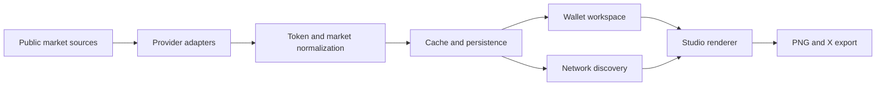

# PNLFlex

**One workspace to track wallets and PnL, then turn onchain data into visuals people want to share.**

[Open PNLFlex](https://pnlflex.xyz) | [Launch Studio](https://pnlflex.xyz/studio) | [Explore Network](https://pnlflex.xyz/network)

## What is PNLFlex?

PNLFlex is a live crypto workspace for two connected jobs:

1. Tracking wallets and PnL with enough context to understand what actually happened.
2. Helping crypto creators turn that market data into clear, branded visuals for X.

Wallet activity, realized PnL, token discovery, chart analysis, and content creation usually live in separate products. PNLFlex brings the full workflow into one place.

## The problem it solves

A trader or researcher should be able to answer:

- What did this wallet trade?
- Where did the profit or loss come from?
- What is happening with the token now?
- How can I explain the move clearly to an audience?

PNLFlex connects four workflows that are normally fragmented across multiple tools:

1. **Track** wallets, positions, activity, and PnL across supported chains.
2. **Discover** tokens across Solana, Base, BNB Chain, Robinhood Chain, and Arc.
3. **Inspect** market cap, liquidity, age, volume, price history, and metadata.
4. **Create** a branded chart visual with themes, drawing tools, annotations, and social-ready export.

## Wallet and PnL workspace

For traders and researchers, PNLFlex provides a structured place to:

- organize multiple EVM and Solana wallets;
- group wallets into watchlists and custom bundles;
- compare balances, positions, activity, and realized PnL;
- inspect the trades behind daily results instead of relying on one headline number;
- distinguish verified PnL from incomplete or unavailable cost basis;
- move naturally from a wallet or position to its token chart.

## Network

The discovery layer is designed for fast scanning and comparison:

- multi-chain search by name, symbol, or contract;
- sortable market cap, liquidity, volume, age, and price change;
- chain-specific token feeds;
- real token imagery with resilient metadata fallbacks;
- direct navigation from any token into Studio;
- watchlists and saved filtering workflows.

## Studio for creators

Studio removes the jump from charting tool to image editor:

- 1D, 7D, 30D, 90D, and 1Y timeframes;
- candlestick, line, and area charts;
- stable market-cap normalization across timeframes;
- token image and metadata resolution across supported networks;
- pen, line, arrow, box, oval, and text tools;
- hover inspection and fixed chart points;
- reusable creator themes, typography, composition, colors, and PNG layers;
- high-resolution PNG and X-ready export.

The wallet workspace provides the story. Studio makes that story understandable and shareable.

## Selected engineering work

| Area | What was built |
| --- | --- |
| Market data | Multi-provider discovery, quote reconciliation, OHLCV normalization, freshness and source metadata |
| Valuation | Market-cap and FDV separation, supply-aware history, timeframe-stable current valuation |
| Rendering | Canvas-based high-resolution charts, candles, volume, labels, markers, themes, and export |
| Interaction | Pointer drawing tools, hover inspection, undo/redo, fixed points, and responsive controls |
| Metadata | Cross-chain symbol and image resolution with Unicode and fallback handling |
| Persistence | Saved Studio projects, creator settings, themes, watchlists, and product state |
| Infrastructure | Cloudflare Workers and D1 with cache-aware public data adapters |

## Architecture

## Stack

JavaScript | HTML Canvas | Cloudflare Workers | Cloudflare D1 | GeckoTerminal | DEX Screener | Lightweight Charts

## Data integrity

PNLFlex treats data quality as part of the interface:

- provider and fetch freshness are visible;
- market cap, FDV, and estimated capitalization are distinct states;
- current valuation is reconciled separately from historical chart sampling;
- missing metadata is shown as unavailable instead of invented;
- public-source fallbacks do not expose credentials in the browser.

## Status

PNLFlex is a live, actively developed product.

- Website: [pnlflex.xyz](https://pnlflex.xyz)
- Studio: [pnlflex.xyz/studio](https://pnlflex.xyz/studio)
- Network: [pnlflex.xyz/network](https://pnlflex.xyz/network)

This repository is a public project overview. Production source, private integrations, operational configuration, user data, and credentials are intentionally not published.

## Author

Built by [@entyper](https://x.com/entyper).

---

**Real data. Clear visuals. Built for the feed.**
